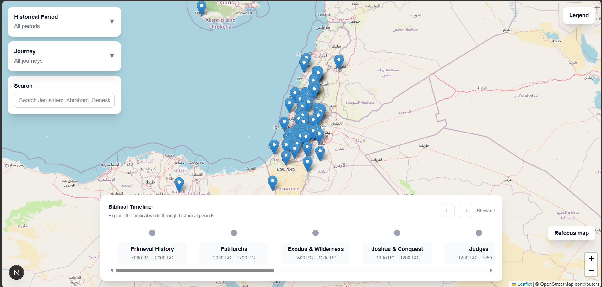
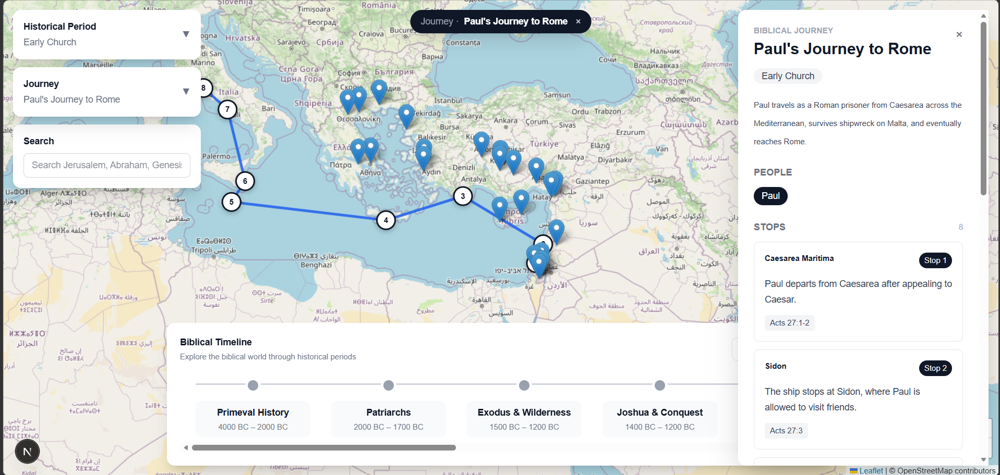
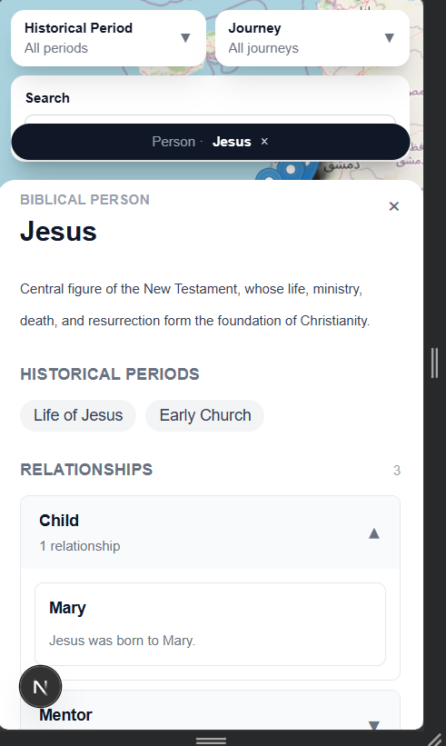

# Interactive Bible Map

An interactive biblical exploration tool that connects Scripture with places, people, events, journeys, relationships, and historical periods.

The application allows users to explore the biblical world through an interactive map and move naturally between interconnected content.

## Features

- Interactive biblical map
- Search across places, people, events, journeys, and Scripture
- Historical-period filtering
- Biblical timeline navigation
- Journey routes with ordered stops
- Dedicated panels for places, people, events, and journeys
- Person relationships and associated content
- Integrated Scripture reader
- Chapter and passage navigation
- Location-identification notes for uncertain or disputed sites
- Responsive layouts for mobile, tablet, laptop, and desktop
- Context-aware map focusing and navigation history

## Biblical periods

The current V1 dataset covers:

- Primeval History
- Patriarchs
- Exodus and Wilderness
- Joshua and the Conquest
- Judges
- United Monarchy
- Divided Kingdom
- Exile
- Return and Restoration
- Life of Jesus
- Early Church

## Technology

- Next.js
- React
- TypeScript
- Tailwind CSS
- Leaflet
- React Leaflet
- OpenStreetMap
- World English Bible

## How it works

The application is built around interconnected biblical entities:

- **Places** contain events and journey stops.
- **People** connect to relationships, places, events, and journeys.
- **Events** connect people, places, historical periods, and Scripture.
- **Journeys** contain ordered geographical stops and references.
- **Scripture references** can be opened directly in the integrated reader.
- **Historical periods** filter and organise the biblical timeline.

This structure allows users to move through the data naturally rather than viewing each item in isolation.

## Screenshots

### Interactive map



### Biblical journeys



### Responsive mobile experience



## Getting started

Clone the repository:

```bash
git clone https://github.com/Abiodun2412/interactive-bible-map.git

